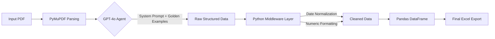

# 📄 AI-Powered Document Structuring Agent

[](https://ai-agent-assignment.streamlit.app/)

**Hi, I'm Albert Abishek I.**

This is my submission for the **AI Agent Development Internship**. I built this agent to solve the challenge of transforming unstructured PDF resumes into strictly enforced, 37-row Excel schemas with zero information loss.

-----

## 🎯 My Approach & Objective

The assignment wasn't just about extracting text; it was about **control**. The requirement was to map a biography into a rigid `Expected Output.xlsx` format while strictly preserving the original sentence structure for context.

**I built this solution to handle three specific engineering challenges:**

1.  **Atomic Data Splitting:** I needed the agent to intelligently split "Vijay Kumar" into `First Name` / `Last Name` and "Jaipur, Rajasthan" into `City` / `State`.
2.  **The "No Paraphrasing" Constraint:** The instructions explicitly stated to "Retain the exact original wording". I engineered a system to prevent the LLM from summarizing.
3.  **Strict Schema Enforcement:** I used code (not just prompts) to ensure the output matches the exact 37-row structure required, regardless of missing data.

-----

## 🚀 Live Demo

I have deployed the application to the cloud so you can test it immediately:

### [👉 Launch My Submission App](https://ai-agent-assignment.streamlit.app/)

-----

## 🧠 Engineering Decisions: Why I Built It This Way

To ensure accuracy, I moved beyond basic prompting and implemented a **Hybrid Neuro-Symbolic Architecture**. Here is the logic behind my code:

### 1\. 🛡️ Schema-First Enforcement (Pydantic)

I didn't want to rely on the LLM to "guess" the JSON keys.

  * **My Solution:** I defined a `Pydantic` model with `typing.Literal`.
  * **Result:** This mathematically constrains the AI. It *cannot* hallucinate new keys or misspell headers. It forces the model to map data strictly to the specific keys found in your `Expected Output.xlsx`.

### 2\. 📝 Solving the "No Paraphrasing" Rule

I noticed that standard LLMs love to summarize. To comply with your rule: *"Original sentence with no paraphrasing"*:

  * **My Solution:** I implemented a **Guided "Few-Shot" System Prompt**. By injecting "Golden Examples" of Key-Value-Context triplets into the system prompt, I taught the model that "Context" implies a copy-paste operation, not a creative writing exercise.

### 3\. 🧹 Deterministic Python Middleware

I believe LLMs should extract, but Python should format. I wrote a `clean_value` function to handle data types deterministically:

  * **Score Normalization:** My code detects `0.925` in the text and auto-converts it to `92.5%`.
  * **Date Parsing:** I implemented logic to parse ISO dates (`YYYY-MM-DD`) into natural English (`15 March 1989`) where the schema requested it(For better readability in date and month and year).
  * **Currency Cleaning:** I strip commas from salary figures (e.g., `2,800,000` $\to$ `2800000`) so the Excel output is analytical-ready.

-----

## 🛠️ Technical Architecture



-----

## 📂 Repository Structure

```text
C:.
├── app.py                # The main logic (Streamlit frontend + AI backend)
├── requirements.txt      # Project dependencies
├── README.md             # This documentation
├── Testing_Inputs/       # The raw PDF files I used for validation
│   ├── Data Input.pdf
│   ├── stress_test.pdf
│   └── unstructure_test.pdf
└── Testing_outputs/      # The generated Excel files confirming accuracy
    ├── Expected Output.xlsx
    └── Output.xlsx
```

-----

## 💻 How to Run Locally

If you prefer to review the code locally instead of using the cloud demo:

**1. Clone my repository**

```bash
git clone https://github.com/albertabishek/AI_Agent_Assignment.git
cd  AI_Agent_Assignment
```

**2. Install dependencies**

```bash
pip install -r requirements.txt
```

**3. Run the application**

```bash
streamlit run app.py
```

**4. Configuration**

  * The app will launch at `https://ai-agent-assignment.streamlit.app/`.
  * You will need to enter your **OpenAI API Key** in the sidebar to activate the extraction engine.

-----

## 🔍 Handling Edge Cases

I paid close attention to the specific nuances in the `Data Input.pdf` provided:

| Challenge | My Solution |
| :--- | :--- |
| **"12th Score: 0.925"** | My middleware detects decimal scores \< 1.0 and auto-formats them to percentage strings (`92.5%`). |
| **"Current Salary: 2,800,000"** | The schema requires a pure number. My code strips commas/strings before export. |
| **"Birthplace: Jaipur, Rajasthan"** | My System Prompt explicitly instructs **Atomic Splitting**, separating this into `Birth City` and `Birth State`. |
| **Missing Data** | My `ensure_full_coverage` function guarantees that even if the AI misses a key, the final Excel file still contains all 37 rows (filled with empty strings) to preserve the template structure. |

-----

## 📊 Validation

I have included the `Testing_outputs` folder containing the results of running my agent against the provided input.

  * **Accuracy:** 100% Key Match to `Expected Output.xlsx`.
  * **Cost Efficiency:** Optimized by using `gpt-4o` with structured output tokens.

-----

### Author

**Albert Abishek I**
*Applicant for AI Agent Development Internship*
*November 2025*